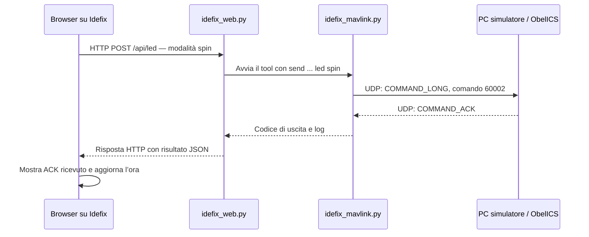

# Idefix Touch — spiegazione del codice

`idefix-touch` è un’applicazione locale composta da una pagina nel browser,
un server Python e il tool MAVLink già utilizzabile da terminale. Gli script
aggiuntivi mostrano la pagina sul touchscreen e ne permettono l’avvio automatico.

Per installare e avviare l’applicazione, vedere il [README](README.md).

## 1. Il percorso di un comando

Quando tocchi **Spin**, avviene questa sequenza:



Browser, server web e tool MAVLink girano tutti su Idefix. Nella configurazione
di prova, il PC svolge il ruolo di ObelICS simulato. Collegando l’hardware reale,
il percorso software sul Raspberry rimane lo stesso.

La pagina invia una richiesta HTTP al server; è il tool Python a costruire e
trasmettere il messaggio MAVLink. Il browser non invia direttamente pacchetti UDP
né controlla GPIO.

## 2. I file

| File | Compito |
|---|---|
| [static/index.html](static/index.html) | Grafica, pulsanti e comportamento della pagina |
| [idefix_web.py](idefix_web.py) | Server HTTP e collegamento con il tool MAVLink |
| [idefix_mavlink.py](idefix_mavlink.py) | Invio dei comandi MAVLink e attesa degli ACK |
| [start-kiosk.sh](start-kiosk.sh) | Avvio di Cage e Chromium sul display |
| [install-services.sh](install-services.sh) | Creazione dei servizi systemd |
| [check-display.sh](check-display.sh) | Diagnostica del display e del touch |
| [test_idefix_web.py](test_idefix_web.py) | Test automatici del backend |
| [requirements.txt](requirements.txt) | Dipendenze Python |
| [README.md](README.md) | Istruzioni operative |

## 3. `static/index.html`: struttura e grafica

Il file contiene HTML, CSS e JavaScript. La struttura riunita in un solo file
rende semplice copiare questa piccola interfaccia sul Raspberry.

### HTML

L’HTML definisce titolo, quattro pulsanti, messaggio di stato, destinazione,
ora dell’ultimo ACK e dettagli del comando.

Un pulsante, semplificato, è fatto così:

```html
<button class="mode" data-mode="spin" aria-pressed="false">
    ...
    <span class="name">Spin</span>
</button>
```

- `class="mode"` identifica lo stile grafico del pulsante.
- `data-mode="spin"` contiene il valore da inviare al server.
- `aria-pressed` descrive la selezione anche agli strumenti di accessibilità.

Il testo visibile può cambiare senza cambiare il comando: **Spegni**, per esempio,
invia `off`. Le icone sono disegni SVG incorporati nell’HTML. La pagina non
scarica icone, font o librerie da Internet e può funzionare offline.

### CSS

Il CSS definisce colori, dimensioni, disposizione e stati visivi. Questa regola
dispone i pulsanti su quattro colonne della stessa larghezza:

```css
.controls {
    display: grid;
    grid-template-columns: repeat(4, 1fr);
    gap: 12px;
}
```

`1fr` assegna a ciascuna colonna una quota uguale dello spazio disponibile.
Una media query cambia la disposizione in due colonne sotto i 650 pixel di
larghezza. Un’altra riduce spazi e altezze sui display bassi, come il DFR0550
800×480. È prevista anche la riduzione delle animazioni quando richiesta dalle
preferenze del browser.

Gli stili `.mode.selected`, `.mode:disabled` e quelli basati su
`data-state` distinguono comando selezionato, pulsanti disabilitati e risposta
in attesa, riuscita o fallita. `touch-action: manipulation` favorisce l’uso dei
pulsanti sul touch; `:focus-visible` mantiene riconoscibile il focus da tastiera.

Il controller touch viene gestito dal sistema grafico e dal browser. Il codice
JavaScript riceve normali eventi sui pulsanti, senza leggere direttamente il
controller `ft5x06`.

## 4. Il JavaScript: dal tocco alla risposta

All’inizio vengono raccolti i pulsanti:

```javascript
const buttons = [...document.querySelectorAll('[data-mode]')];
```

`querySelectorAll` cerca gli elementi con l’attributo `data-mode`; `[...]`
converte il risultato in un array. Alla fine dello script viene associato un
gestore dell’evento `click` a ciascun pulsante:

```javascript
button.addEventListener('click', () => send(button.dataset.mode));
```

Toccando Spin, `button.dataset.mode` vale `"spin"` e viene chiamata `send("spin")`.

### Preparazione e invio

`send()` è `async`: può attendere una risposta dal server senza bloccare
l’interfaccia del browser. Prima dell’invio:

```javascript
if (pending) return;
pending = true;
buttons.forEach(button => button.disabled = true);
select(null);
```

`pending` impedisce a un secondo evento di avviare un’altra richiesta nella
stessa pagina. I pulsanti vengono disabilitati e la selezione precedente viene
rimossa, perché il nuovo comando non è ancora confermato. La funzione
`feedback()` mostra quindi **Invio in corso…**.

La richiesta viene inviata con `fetch`:

```javascript
const response = await fetch('/api/led', {
    method: 'POST',
    headers: {
        'Content-Type': 'application/json',
        'X-Idefix-Token': token
    },
    body: JSON.stringify({mode}),
    signal: abort.signal
});
```

`POST` richiede un’azione al server. `JSON.stringify({mode})` converte l’oggetto
JavaScript in testo JSON; per Spin il corpo è:

```json
{"mode":"spin"}
```

Il percorso `/api/led` è relativo all’origine della pagina. Sul touchscreen,
che apre `http://127.0.0.1:8080`, la richiesta raggiunge
`http://127.0.0.1:8080/api/led`.

### Elaborazione del risultato

La risposta viene convertita in un oggetto JavaScript:

```javascript
const result = await response.json();
```

La condizione `response.ok && result.ok` verifica sia l’esito HTTP sia quello
dichiarato dall’applicazione. In caso di successo, `select(mode)` evidenzia il
pulsante e `feedback()` mostra il messaggio ricevuto e **ACK ricevuto**.

`feedback()` aggiorna il tipo di stato, l’icona e i testi; `select()` aggiorna
la classe CSS `selected` e l’attributo `aria-pressed` dei pulsanti.

Gli eventuali log vengono mostrati nella sezione **Dettagli del comando**.
L’uso di `textContent` li inserisce come testo, senza interpretarli come HTML.

Il blocco `finally` viene eseguito sia dopo il successo sia dopo un errore:

```javascript
finally {
    clearTimeout(timer);
    pending = false;
    buttons.forEach(button => button.disabled = false);
}
```

In questo modo i pulsanti tornano utilizzabili. `AbortController` impone anche
un limite di 45 secondi all’attesa HTTP. Interrompere l’attesa nel browser non
annulla un comando eventualmente già inviato a ObelICS. Il messaggio di errore
parla perciò di esito non confermato.

### Ora e stato della pagina

L’ora viene calcolata dopo una risposta positiva:

```javascript
new Date().toLocaleTimeString('it-IT', {
    timeZone: 'Europe/Rome',
    hour: '2-digit',
    minute: '2-digit',
    second: '2-digit'
});
```

`new Date()` legge l’orologio del dispositivo che esegue il browser: sul
touchscreen è Idefix, mentre aprendo la pagina sul PC è il PC. `Europe/Rome`
regola la visualizzazione, inclusa l’ora legale, ma non sincronizza l’orologio.

Il timestamp indica quando la pagina riceve il risultato positivo, leggermente
dopo la ricezione del pacchetto MAVLink. Non viene trasmesso da ObelICS e non è
un orologio che avanza continuamente: cambia al successivo ACK accettato.

Selezione e ultimo ACK rimangono nella memoria della singola pagina. Una
ricarica li azzera. Non c’è una cronologia persistente o una sincronizzazione
dello stato visualizzato tra più browser.

## 5. `idefix_web.py`: il server HTTP

Il server usa la libreria standard di Python, senza Flask o altri framework.
`ROOT = Path(__file__).resolve().parent` individua la cartella del programma,
così può trovare HTML e tool senza dipendere dalla directory corrente.

All’avvio, `main()` legge gli argomenti, controlla porte, timeout e tentativi,
verifica la disponibilità di `pymavlink`, crea un `Controller` e avvia:

```python
ThreadingHTTPServer(
    (args.web_bind, args.web_port),
    make_handler(Controller(args))
)
```

`ThreadingHTTPServer` gestisce richieste in thread separati: una richiesta
informativa può essere servita mentre un’altra attende l’esito MAVLink.
`serve_forever()` mantiene il server attivo fino all’arresto.

### Indirizzi e porte

| Opzione | Significato | Default |
|---|---|---|
| `--host` | Destinatario MAVLink: PC simulatore oppure ObelICS | Obbligatorio |
| `--port` | Porta UDP del destinatario | `14550` |
| `--bind` | Indirizzo locale del socket MAVLink | `0.0.0.0` |
| `--local-port` | Porta UDP locale per gli ACK | `14551` |
| `--web-bind` | Indirizzo di ascolto del server HTTP | `127.0.0.1` |
| `--web-port` | Porta HTTP | `8080` |

Le opzioni MAVLink sono riutilizzate importando `add_sender_options()` dal tool.
Il server web cambia il default di `retries` a 1.

`127.0.0.1` identifica il dispositivo stesso: sul touchscreen browser e server
comunicano localmente anche senza Wi-Fi. Il collegamento Ethernet con ObelICS
è separato. `--web-bind 0.0.0.0` rende invece la pagina raggiungibile anche dalle
interfacce di rete; chi può aprirla può comandare i LED.

### Percorsi HTTP

| Richiesta | Funzione |
|---|---|
| `GET /` | Restituisce la pagina HTML |
| `GET /api/info` | Restituisce destinazione e indicazione di comando in corso |
| `POST /api/led` | Richiede l’invio di un comando LED |

Una risposta di `/api/info` può essere:

```json
{"target":"192.168.10.2","busy":false}
```

La pagina la richiede una volta al caricamento e usa `target`. Il campo `busy`
è disponibile, ma non viene attualmente usato dal frontend. Questa risposta
conferma il funzionamento del server web, non la raggiungibilità di ObelICS.

`make_handler()` crea la classe che gestisce le richieste, mantenendo accessibili
lo stesso controller, il token e il contenuto HTML. L’HTML viene letto una volta
all’avvio: una sua modifica richiede il riavvio del backend e la ricarica della
pagina.

### Token e validazione

All’avvio viene generato un token casuale:

```python
token = secrets.token_urlsafe(32)
```

Il token sostituisce `__TOKEN__` nel documento HTML. Il browser lo legge dal tag
`meta` e lo rimanda nell’header `X-Idefix-Token`.

Questo ostacola richieste provenienti da pagine estranee, ma non è un sistema
di autenticazione: chi può ottenere la pagina può ottenere anche il token.
Dopo un riavvio del backend cambia, quindi la pagina precedente va ricaricata.

Il gestore POST accetta soltanto `/api/led`, controlla il token, richiede il
tipo `application/json` e limita il corpo a 256 byte. Il JSON deve essere un
oggetto; il campo `mode` viene poi verificato dal controller.

`reply()` serializza i dizionari in JSON, imposta tipo e lunghezza della risposta
e la scrive al browser. `Cache-Control: no-store` evita la memorizzazione delle
risposte; gli altri header impediscono l’incorporamento in frame e richiedono
il rispetto del tipo di contenuto dichiarato. Una connessione chiusa dal
browser durante la scrittura viene gestita senza alterare l’esito del comando.

## 6. `Controller`: eseguire il tool e restituire l’esito

Le sole modalità consentite sono:

```python
MODES = {
    "off": "Spento",
    "bounce": "Bounce",
    "spin": "Spin",
    "blink": "Blink"
}
```

Qualsiasi altro valore, inclusi i servo, viene rifiutato prima dell’esecuzione.

### Un comando alla volta

Il controller usa un lock:

```python
if not self.lock.acquire(blocking=False):
    return 409, ...
```

Il lock impedisce a due richieste HTTP di avviare contemporaneamente sender
che tenterebbero di occupare la stessa porta UDP 14551. Protegge anche da
richieste provenienti da browser diversi; il flag JavaScript `pending`, invece,
vale soltanto nella singola pagina.

`blocking=False` significa che una richiesta concorrente viene rifiutata subito,
non messa in coda. Il lock non controlla programmi esterni: una console
`interactive` lasciata aperta può comunque occupare la porta.

### Esecuzione come processo separato

Il controller costruisce una lista di argomenti equivalente a:

```text
python idefix_mavlink.py send --host 192.168.10.2 ... led spin
```

L’interprete è `sys.executable`, lo stesso con cui gira il backend, quindi quello
del suo ambiente `.venv`. L’esecuzione è:

```python
result = subprocess.run(
    command,
    capture_output=True,
    text=True,
    timeout=(self.args.retries + 1) * self.args.timeout + 5,
)
```

Per ogni comando nasce un nuovo processo MAVLink. Il backend rimane attivo;
il figlio apre il socket, invia, attende l’ACK, chiude il socket e termina.
La scelta riutilizza il tool collaudato, al costo di un piccolo tempo di avvio
per ogni richiesta. Non c’è una connessione MAVLink permanente del server web.

Gli argomenti sono una lista e non viene usato `shell=True`: non vengono
interpretati come una riga di comandi della shell. `capture_output=True`
raccoglie output normale ed errori; `text=True` li restituisce come stringhe.

### Esiti e timeout

Il codice di uscita 0 del tool corrisponde a un ACK accettato. Il backend lo
traduce in HTTP 200 e `"ok": true`; non decodifica direttamente MAVLink.

Per distinguere gli errori cerca nei log stringhe come `nessun ACK` e
`ACK MAV_RESULT_`. Se i testi del tool cambiano, questa classificazione va
aggiornata, anche se il controllo del successo rimane basato sul codice di uscita.

| HTTP | Significato nell’applicazione |
|---|---|
| `200` | Comando accettato |
| `400` | Richiesta o modalità non valida |
| `403` | Token non valido |
| `404` | Percorso non previsto |
| `409` | Un comando è già in corso |
| `502` | Invio fallito o ACK non accettato |
| `504` | Il processo ha superato il tempo massimo |

Con i default del pannello sono previsti 2 secondi per tentativo e 1 ritentativo,
quindi fino a 2 invii. Il limite esterno del processo è 9 secondi:
`(1 + 1) × 2 + 5`. I 45 secondi del browser sono un limite ulteriore per HTTP.

Il `finally` rilascia sempre il lock, anche dopo un errore o un timeout.

## 7. `idefix_mavlink.py`: protocollo e simulatore

È la copia del tool già usato da terminale, con i servo commentati. La pagina
utilizza `send`; `interactive`, `test-all` e `listen` restano disponibili per
le prove indipendenti.

| Modalità | ID MAVLink |
|---|---:|
| `off` | `60000` |
| `bounce` | `60001` |
| `spin` | `60002` |
| `blink` | `60003` |

`parse_mode()` converte nomi come `spin` nell’elemento corrispondente di `LedMode`.
`open_sender()` apre una connessione UDP e la lega alla porta locale 14551,
mantenendo coerente il percorso di ritorno degli ACK previsto per ObelICS.

`send_one()` invia un heartbeat prima di ogni tentativo, poi un `COMMAND_LONG`
con l’ID scelto, il numero di tentativo nel campo confirmation e i sette parametri
a zero. Il dialect Python rimane `common`, perché i messaggi sono standard:
i valori specifici del progetto sono gli ID dei comandi.

`wait_for_ack()` cerca un `COMMAND_ACK` con il comando corretto e destinazione
compatibile con gli ID di Idefix. Gli ID predefiniti sono system 42/component 191
per Idefix e system 1/component 1 per il destinatario. La verifica attuale filtra
comando e destinatario dell’ACK; non verifica esplicitamente gli ID del mittente.

Il tempo di attesa usa `time.monotonic()`, che misura il tempo trascorso: una
correzione dell’ora di sistema non altera la scadenza del timeout.

Il tool termina con 0 per un ACK accettato, 1 per il fallimento del comando e 2
per alcuni errori di configurazione o apertura del socket. Il backend legge
questo risultato e i log.

`listen`, eseguito sul PC, riceve `COMMAND_LONG`, controlla destinatario e ID,
stampa RX e restituisce `COMMAND_ACK`. Simula la risposta di ObelICS senza
azionare LED fisici.

Anche con l’hardware reale, il pulsante evidenziato significa **ultimo comando
accettato**. Non misura l’accensione dei LED e non riceve telemetria continua:
un reset di ObelICS o un cambiamento effettuato altrove non aggiorna da solo
la selezione della pagina.

## 8. `start-kiosk.sh`: visualizzazione locale

Lo script controlla che il browser non venga eseguito come root e che esista
`XDG_RUNTIME_DIR`. Quest’ultimo controllo verifica un requisito della sessione,
ma da solo non garantisce l’accesso al display.

Attende che il backend risponda a `/api/info`, con tentativi curl di massimo
2 secondi e una pausa di 1 secondo. Questo evita di aprire Chromium prima che
il server web sia pronto.

Poi esegue:

```sh
exec cage -s -- chromium \
    --ozone-platform=wayland \
    --kiosk --no-first-run --noerrdialogs \
    --user-data-dir="$HOME/.local/share/idefix-kiosk" \
    http://127.0.0.1:8080
```

Cage gestisce la sessione grafica e gli input; Chromium mostra la pagina.
`--kiosk` abilita lo schermo intero, `--ozone-platform=wayland` sceglie il backend
grafico Wayland e `--user-data-dir` mantiene un profilo dedicato al pannello.
`-s` permette il cambio di console virtuale. La sandbox di Chromium rimane attiva.

`exec` sostituisce lo script con Cage, evitando una shell intermedia in attesa.
Il percorso automatico usa la porta HTTP 8080: cambiandola nel backend va
aggiornato anche questo script.

## 9. `install-services.sh`: sessione e avvio automatico

L’installer richiede privilegi amministrativi perché scrive sotto `/etc`.
Non installa i pacchetti grafici: questi devono essere già disponibili.

Controlla IPv4 del destinatario, percorso dell’applicazione, presenza dell’utente
`pi`, programmi necessari, console tty7, file leggibili e ambiente `.venv` con
pymavlink. Si arresta se è attivo un altro display manager. L’utente `pi` è
attualmente fissato nel codice; la directory viene ricavata dalla posizione
dell’installer.

Prima di sostituire i propri file di configurazione esistenti, ne conserva
copie con suffisso temporale. Crea quindi:

| File installato | Funzione |
|---|---|
| `/etc/systemd/system/idefix-web.service` | Gestione del backend Python |
| `/etc/systemd/system/idefix-kiosk.service` | Gestione della sessione grafica |
| `/etc/pam.d/idefix-kiosk` | Registrazione della sessione locale tramite PAM/logind |

### Servizio web

Il backend gira come `pi` dalla cartella dell’applicazione, usando il Python
del venv. L’IP passato all’installer viene scritto nell’argomento `--host`.
Il bind HTTP rimane quello predefinito, `127.0.0.1`.

`Restart=on-failure` e `RestartSec=3` richiedono un riavvio dopo 3 secondi in
caso di errore, nei limiti delle politiche di systemd. `After=network.target`
definisce un ordine di avvio, ma non garantisce che ObelICS sia raggiungibile.

### Servizio kiosk

Il kiosk gira come `pi` sulla console virtuale tty7. PAM e `systemd-logind`
registrano una sessione locale per l’accesso a video e input. `dbus-run-session`
crea una sessione D-Bus per l’esecuzione dello script. L’azione `chvt 7` porta
il display sulla console usata dal kiosk.

`Wants` richiede l’avvio del backend e dei servizi necessari; `After` imposta
l’ordine. L’attesa curl dello script controlla poi che il backend risponda davvero.
`Restart=always` e `RestartSec=5` richiedono il riavvio dopo una terminazione;
un arresto esplicito tramite `systemctl stop` rimane comunque un arresto.

È possibile avviare tutto da SSH perché SSH chiede a systemd di creare questa
sessione locale. Il browser non viene eseguito dentro il terminale SSH.

### Installazione, riavvio e abilitazione

- `systemctl daemon-reload` rilegge le definizioni dei servizi.
- `systemctl restart` riavvia i programmi adesso.
- `systemctl enable` li collega all’avvio automatico.

L’installer esegue `daemon-reload`, ma non avvia né abilita da solo i servizi.
Per modifiche a HTML o Python normalmente bastano copia dei file e riavvio dei
servizi. Rieseguire l’installer serve quando cambiano definizioni, percorso o IP.

I servizi sono collegati a `multi-user.target`: non occorre cambiare il target
predefinito. L’installer non modifica SSH, hotspot o indirizzi Ethernet.

## 10. Diagnostica, dipendenze e test

`check-display.sh` legge sistema operativo, kernel, dispositivi DRM, input,
opzioni di boot relative al display e pacchetti grafici. Non modifica la
configurazione. I comandi facoltativi gestiscono l’assenza di file o dispositivi.

`requirements.txt` contiene soltanto:

```text
pymavlink>=2.4.40,<3
```

Gli altri moduli del backend fanno parte della libreria standard Python.
Cage e Chromium sono invece programmi installati tramite il gestore di pacchetti
del sistema operativo.

`test_idefix_web.py` contiene 11 test eseguibili con:

```bash
python3 -m unittest -v
```

Usa mock, cioè sostituti controllati delle chiamate esterne, per verificare:

- i quattro comandi LED e il rifiuto di servo o valori non validi;
- il rifiuto di un secondo invio mentre il lock è occupato;
- ACK accettati, rifiutati, mancanti, timeout ed errori di porta;
- token, struttura delle richieste e instradamento degli endpoint;
- l’assenza di invii MAVLink causati da richieste GET.

I test HTTP unitari chiamano i gestori senza aprire un vero server; quelli del
controller sostituiscono `subprocess.run`. La prova browser → HTTP → tool → UDP
→ simulatore è stata effettuata separatamente, insieme alla verifica del layout
800×480 e del comportamento quando il simulatore non risponde.

`__pycache__` è generata automaticamente da Python. Un eventuale file
`anteprima-800x480.png` è una cattura della prima versione grafica, non una
risorsa usata dall’applicazione; non è incluso nello ZIP aggiornato.

## 11. Dove intervenire per le modifiche

| Modifica | File principale |
|---|---|
| Testi, colori, dimensioni, disposizione | `static/index.html` |
| Comportamento dei pulsanti e visualizzazione degli esiti | JavaScript in `static/index.html` |
| Validazione HTTP e gestione dell’esecuzione del tool | `idefix_web.py` |
| Comandi, ID e protocollo MAVLink | `idefix_mavlink.py` |
| Avvio del browser e URL locale | `start-kiosk.sh` |
| Utente, console, processi e avvio al boot | `install-services.sh` |

## Riferimenti

- [DFRobot DFR0550](https://www.dfrobot.com/product-1784.html)
- [Wiki DFR0550](https://wiki.dfrobot.com/dfr0550/)
- [Cage su Debian Trixie](https://packages.debian.org/trixie/cage)
- [Manuale Cage](https://manpages.debian.org/trixie/cage/cage.1.en.html)
- [Chromium su Debian Trixie](https://packages.debian.org/trixie/chromium)
- [Avvio di Cage con systemd](https://github.com/cage-kiosk/cage/wiki/Starting-Cage-on-boot-with-systemd)
